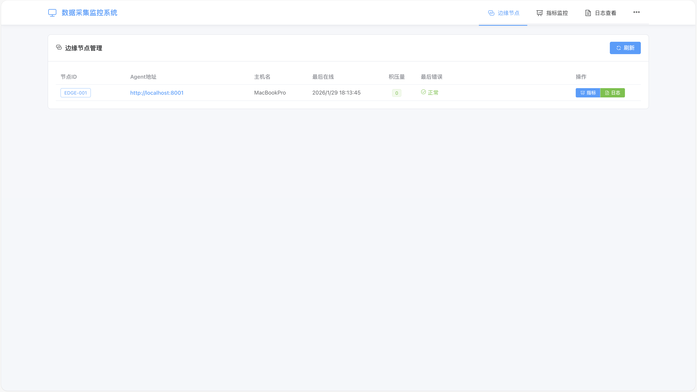
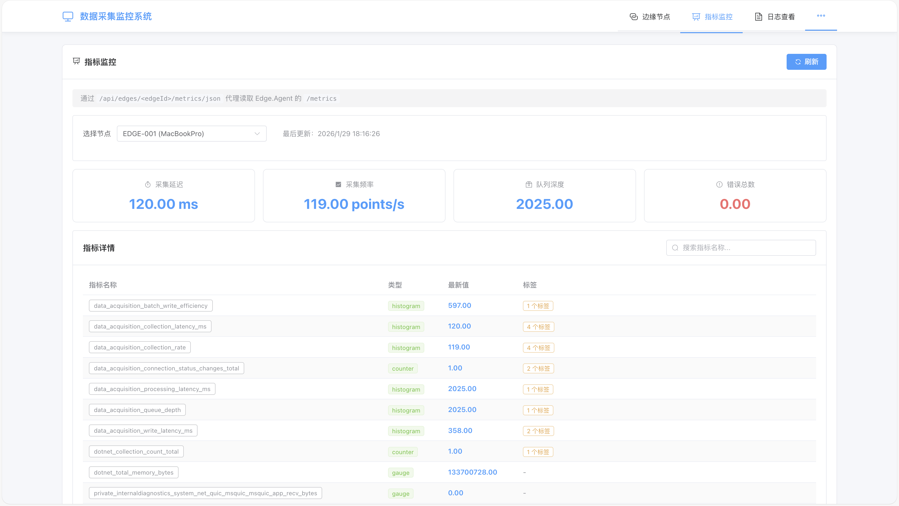
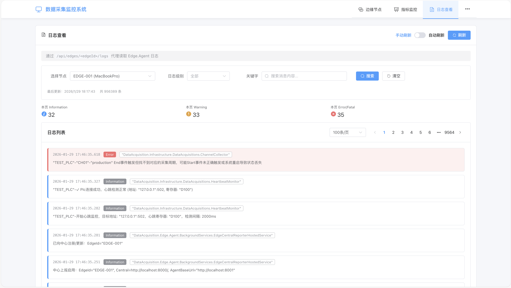

# 🛰️ DataAcquisition - Industrial PLC Data Acquisition System

[](https://dotnet.microsoft.com/)
[](LICENSE)
[](https://dotnet.microsoft.com/)
[]()
[]()
[]()

中文: [README.md](README.md)

## 📋 Table of Contents

- [📖 Project Overview](#-project-overview)
- [🎯 Core Features](#-core-features)
- [✨ Use Cases](#-use-cases)
- [🏗️ System Architecture](#-system-architecture)
- [📁 Project Structure](#-project-structure)
- [🚀 Quick Start](#-quick-start)
- [📸 Screenshots](#-screenshots)
- [📚 Tutorial Navigation](#-tutorial-navigation)
- [📖 Documentation Navigation](#-documentation-navigation)
- [🤝 Contributing Guidelines](#-contributing-guidelines)
- [📄 Open Source License](#-open-source-license)
- [🙏 Acknowledgments](#-acknowledgments)

## 📖 Project Overview

DataAcquisition is an industrial-grade PLC data acquisition system built on .NET. The system employs a **WAL-first (Write-Ahead Logging) architecture** to ensure zero data loss, supports **Edge-Central distributed architecture** for centralized management across multiple workshops. It provides advanced features like multi-PLC parallel acquisition, conditional trigger acquisition, and batch reading optimization, supports configuration hot updates and real-time monitoring, ready to use out of the box, operations-friendly.

**Tech Stack:**
- Runtime: .NET 10.0
- Data Storage: InfluxDB 2.x (time-series database) + Parquet (local WAL)
- Monitoring: Prometheus metrics + Vue3 visualization interface
- Architecture: Edge-Central distributed architecture

### 🎯 Core Features

#### 🔒 WAL-first Data Safety Architecture

The system follows a **Write-Ahead Log (WAL)-first** design to ensure zero data loss:

```
Acquisition → Parquet WAL (local) → InfluxDB (remote)
       ↓ (keep on failure)   ↓ (retry on failure)
  pending/ directory      retry/ directory
```

- **Dual guarantee**: data is written to local Parquet and InfluxDB in parallel
- **Automatic retry**: background worker scans retry/ every 5 seconds
- **Crash-safe**: network outages or DB downtime will not lose data

#### ⚡ High-Performance Acquisition

| Feature | Description |
|---------|-------------|
| **Batch Read** | Read contiguous registers in one call, significantly reducing network round trips and improving acquisition speed |
| **Parallel Devices** | Multi-PLC, multi-channel async parallel acquisition |
| **Conditional Mode** | Capture only on events, avoiding unnecessary data writes |
| **Batch Write** | Aggregate by BatchSize before writing, reducing DB write frequency |

#### 🎯 Intelligent Acquisition Modes

**Always Mode** (continuous)
- For temperature/pressure/current and other continuous signals
- Fixed interval sampling

**Conditional Mode** (event-driven)
- For production cycle or state changes
- Supports RisingEdge and FallingEdge
- Emits Start/End events with CycleId for full cycle trace

#### 🌐 Edge-Central Distributed Architecture

- **Edge Agent**: runs on the shop floor for PLC collection and local persistence
- **Central API**: manages edge registration, heartbeats, and telemetry
- **Central Web**: Vue3 UI for real-time monitoring

#### 🔄 Hot Configuration Reload

- Reload config files automatically (default 500ms)
- Supports device and app settings
- No service restart required

#### 📊 Observability Built-in

- **Prometheus metrics**: latency, queue depth, write time, error counts
- **Vue3 UI**: edge status and system metrics
- **Log query**: SQLite log storage with API access

#### 🔀 Multi-Protocol Support

- Mitsubishi PLC
- Inovance PLC
- BeckhoffAds PLC
- Extend via `IPlcClientService`

## ✨ Use Cases

### 📦 Production Line Data Collection

**Scenario**: 50+ stations need real-time process parameters and quality tracking.

**Solution**:
- Deploy Edge Agent per station to collect PLC data
- Use Conditional Mode to capture each product cycle
- Link full cycle data with CycleId

**Outcome**:
- ✅ WAL-first architecture ensures zero data loss for traceability
- ✅ Event-driven capture records only relevant production data, saving storage
- ✅ Batch read optimization reduces acquisition latency

### 🏭 Multi-Workshop Centralized Monitoring

**Scenario**: 5 workshops across different locations require centralized monitoring.

**Solution**:
- Edge Agent deployed in each workshop
- Central API aggregates heartbeats and status
- Central Web provides a unified UI

**Outcome**:
- ✅ Distributed resilience (no single point impact)
- ✅ Centralized operations and monitoring
- ✅ Fast issue localization

### 🔧 Predictive Maintenance

**Scenario**: Monitor compressors/pumps for vibration, temperature, and pressure to predict failures.

**Solution**:
- Always Mode for continuous sampling
- Store 1-year history in InfluxDB
- Grafana alerts on thresholds and trends

**Outcome**:
- ✅ Real-time equipment health monitoring
- ✅ Historical trend analysis to support maintenance decisions
- ✅ Reduced risk of unplanned downtime

### 📊 Batch Traceability

**Scenario**: Record all parameters for each production batch.

**Solution**:
- Conditional Mode triggers Start/End events
- Store all key parameters between Start/End
- Query by CycleId for full batch history

**Outcome**:
- ✅ Full batch traceability
- ✅ Fast root-cause analysis
- ✅ Compliance-ready records

## 🏗️ System Architecture

### Distributed Architecture Overview

The system adopts an **Edge-Central distributed architecture**, supporting centralized management and monitoring of multiple workshops and nodes:

```
                    ┌─────────────────────────────────────────┐
                    │           Central Web (Vue3)            │
                    │     Visualization / Monitoring Panel    │
                    └───────────────────┬─────────────────────┘
                                        │ HTTP/API
                    ┌───────────────────▼─────────────────────┐
                    │         Central API                     │
                    │  • Edge Node Registration/Heartbeat     │
                    │  • Telemetry Data Ingestion             │
                    │  • Query & Management APIs              │
                    │  • Prometheus Metrics Aggregation       │
                    └───────┬─────────────────────┬───────────┘
                            │                     │
              ┌─────────────┘                     └───────────┐
              │                                               │
    ┌─────────▼─────────┐                          ┌──────────▼────────┐
    │   Edge Agent #1   │                          │   Edge Agent #N   │
    │    ( Node 1)      │                          │     ( Node N)     │
    └─────────┬─────────┘                          └─────────┬─────────┘
              │                                              │
              └──────────────────────────────────────────────┘
```

### Edge Agent Internal Architecture

Each Edge Agent adopts a layered architecture design with clear responsibilities at each layer to ensure zero data loss:

```
┌────────────────────────────┐        ┌──────────────────────────┐
│        PLC Device          │──────▶ │  Heartbeat Monitor Layer │
└────────────────────────────┘        └──────────────────────────┘
                 │
                 ▼
┌────────────────────────────┐
│   Data Acquisition Layer   │
└────────────────────────────┘
                 │
                 ▼
┌────────────────────────────┐
│    Queue Service Layer     │
└────────────────────────────┘
                 │
                 ▼
┌────────────────────────────┐
│          Storage Layer     │
└────────────────────────────┘
                 │
                 ▼
┌────────────────────────────┐        ┌──────────────────────────────┐
│      WAL Persistence       │──────▶ │ Time-Series Database Storage │
└────────────────────────────┘        └──────────────────────────────┘
                 │                                 │
                 ▼                                 │  Write Failed
┌────────────────────────────┐                     │
│      Retry Worker          │◀────────────────────┘
└────────────────────────────┘
```

### Core Data Flow

#### Edge Agent Internal Flow

1. **Data Acquisition Phase**: PLC devices → `ChannelCollector` (supports conditional triggers, batch reading optimization)
2. **Data Aggregation Phase**: `QueueService` aggregates data by configured `BatchSize`
3. **Data Persistence Phase**:
   - **Parquet WAL**: Immediate write to local Parquet files (write-ahead logging, ensures zero loss)
   - **InfluxDB**: Synchronous write to time-series database (primary storage)
4. **Fault Tolerance Phase**: Delete WAL files on successful write; retain WAL files on failure for periodic retry by `RetryWorker`
5. **Data Reporting Phase**: Optionally report data to Central API (for centralized management and monitoring)

#### Edge-Central Interaction Flow

1. **Node Registration Phase**: Edge Agent automatically registers with Central API on startup (EdgeId, AgentBaseUrl, Hostname)
2. **Heartbeat Reporting Phase**: Periodically sends heartbeat information (default 10 seconds interval), includes queue backlog, error information, and other status
3. **Telemetry Data Reporting Phase**: Batch reports collected time-series data to Central API (optional feature)
4. **Monitoring Query Phase**: Central Web frontend queries edge node status, metrics, and logs through Central API

## 📁 Project Structure

```
DataAcquisition/
├── src/DataAcquisition.Application/     # Application Layer - Interface Definitions
│   ├── Abstractions/               # Core Interface Abstractions
│   └── PlcRuntime.cs              # PLC Runtime
├── src/DataAcquisition.Contracts/       # Contracts Layer - External DTOs/Protocols
├── src/DataAcquisition.Domain/         # Domain Layer - Core Models
│   └── Models/                     # Data Models
├── src/DataAcquisition.Infrastructure/ # Infrastructure Layer - Implementations
│   ├── Clients/                    # PLC Client Implementations
│   ├── DataAcquisitions/           # Data Acquisition Services
│   ├── DataStorages/               # Data Storage Services
│   └── Metrics/                    # Metrics Collection
├── src/DataAcquisition.Edge.Agent/ # Edge Agent - workshop acquisition + metrics + local APIs
│   ├── Configs/                    # Device configuration files
│   └── Controllers/                # Management API controllers
├── src/DataAcquisition.Central.Api/ # Central API - central-side APIs (edge register/heartbeat/ingest, query & admin)
├── src/DataAcquisition.Central.Web/ # Central Web - pure frontend (Vue CLI / Vue3), talks to Central API via /api
├── src/DataAcquisition.Simulator/      # PLC Simulator - For Testing
│   ├── Simulator.cs               # Simulator Core Logic
│   ├── Program.cs                 # Program Entry Point
│   └── README.md                  # Simulator Documentation
└── DataAcquisition.sln             # Solution File
```

## 🚀 Quick Start

### Method 1: Local Deployment (Recommended for Beginners)

Check out the [Getting Started Tutorial](docs/tutorial-getting-started.en.md), which provides complete steps from scratch, including:

- Prerequisites and installation steps
- InfluxDB configuration instructions
- Device configuration file creation
- System startup and verification
- Testing with PLC simulator

### Method 2: Docker Quick Start (Recommended for Testing)

Use Docker Compose to quickly deploy InfluxDB without manual database installation:

```bash
# Start InfluxDB
docker-compose up -d influxdb

# Initialize (visit http://localhost:8086)
# Username: admin, Password: admin123

# Update Token in appsettings.json

# Start Edge Agent
dotnet run --project src/DataAcquisition.Edge.Agent
```

Detailed guide: [Docker InfluxDB Deployment Guide](docs/docker-influxdb.en.md)

> **Tip**: If this is your first time using the system, we recommend following the steps in the [Getting Started Tutorial](docs/tutorial-getting-started.en.md). If you're already familiar with the system, you can directly check the [Configuration Tutorial](docs/tutorial-configuration.en.md) and [API Usage Examples](docs/api-usage.en.md).

### 🧪 Testing with PLC Simulator

The project includes a standalone PLC simulator (`DataAcquisition.Simulator`) that simulates Mitsubishi PLC behavior for testing data acquisition functionality without requiring actual PLC hardware.

#### Start the Simulator

```bash
cd src/DataAcquisition.Simulator
dotnet run
```

#### Simulator Features

- ✅ Simulates Mitsubishi PLC (MelsecA1EServer)
- ✅ Auto-updates heartbeat register (D100)
- ✅ Simulates 7 sensor metrics (temperature, pressure, current, voltage, light barrier position, servo speed, production serial number)
- ✅ Supports conditional acquisition testing (production serial trigger)
- ✅ Interactive command control (set/get/info/exit)
- ✅ Real-time data display

#### Quick Test Flow

1. **Start the Simulator**:

```bash
cd src/DataAcquisition.Simulator
dotnet run
```

2. **Configure Test Device**:

   Create `TEST_PLC.json` in `src/DataAcquisition.Edge.Agent/Configs/` directory (refer to the complete configuration example in `src/DataAcquisition.Simulator/README.md`)

3. **Start the Acquisition System**:

```bash
dotnet run --project src/DataAcquisition.Edge.Agent
dotnet run --project src/DataAcquisition.Central.Api

cd src/DataAcquisition.Central.Web
npm install
npm run serve
```

4. **Observe Data Acquisition**:
   - Visit http://localhost:3000 for the central UI (Edges/Metrics/Logs)
   - Visit http://localhost:8000/metrics for Central API's own metrics page
   - Check the `sensor` and `production` measurements in InfluxDB

For detailed information, please refer to: [src/DataAcquisition.Simulator/README.md](src/DataAcquisition.Simulator/README.md)

## 📸 Screenshots

### Central Web UI

> **Note**: The following are illustrative mockups. Actual UI reflects real-time data.

**Edge Nodes List**


**System Metrics**


**Logs List**


### Prometheus Metrics

Visit `http://localhost:5000/metrics` to view metrics:

```prometheus
# HELP data_acquisition_collection_latency_ms Collection latency(ms)
# TYPE data_acquisition_collection_latency_ms gauge
data_acquisition_collection_latency_ms{device="PLC01",channel="PLC01C01"} 12.5

# HELP data_acquisition_queue_depth Queue depth
# TYPE data_acquisition_queue_depth gauge
data_acquisition_queue_depth{device="PLC01"} 45

# HELP data_acquisition_errors_total Total errors
# TYPE data_acquisition_errors_total counter
data_acquisition_errors_total{device="PLC01",type="connection"} 0
```

### InfluxDB Query Example

```flux
from(bucket: "iot")
  |> range(start: -1h)
  |> filter(fn: (r) => r["_measurement"] == "sensor")
  |> filter(fn: (r) => r["device_code"] == "PLC01")
  |> filter(fn: (r) => r["_field"] == "temperature")
  |> yield(name: "temperature")
```

## 📚 Tutorial Navigation

Follow the main learning path: Getting Started → Configuration → Deployment → Querying → Development.

- [Getting Started Tutorial](docs/tutorial-getting-started.en.md)
- [Configuration Tutorial](docs/tutorial-configuration.en.md)
- [Deployment Tutorial](docs/tutorial-deployment.en.md)
- [Data Query Tutorial](docs/tutorial-data-query.en.md)
- [Development Tutorial](docs/tutorial-development.en.md)

Full index: [Documentation Index](docs/index.en.md)

## 📖 Documentation Navigation

Use the master entry: [Documentation Index](docs/index.en.md)

Choose the appropriate documentation reading path based on your use case:

### New User Getting Started

If this is your first time using the system, we recommend reading in the following order:

1. **[Getting Started Tutorial](docs/tutorial-getting-started.en.md)** - Get started from scratch, quickly get up and running
   - Prerequisites and installation steps
   - System configuration and startup
   - Testing with PLC simulator

2. **[Configuration Tutorial](docs/tutorial-configuration.en.md)** - Learn how to configure the system
   - Device configuration file details
   - Application configuration instructions
   - Configuration examples and use cases

3. **[FAQ](docs/faq.en.md)** - Reference when encountering issues
   - Common questions and answers
   - Troubleshooting guide
   - Configuration verification methods

### Daily Use

If you're already familiar with the system and need daily use and maintenance:

- **[API Usage Examples](docs/api-usage.en.md)** - Query data and manage the system
  - Metrics data query
  - PLC connection status query
  - Log query and management

- **[Performance Optimization Recommendations](docs/performance.en.md)** - Optimize system performance
  - Acquisition parameter tuning
  - Storage optimization strategies
  - System resource optimization

### Deep Dive

If you want to understand the system architecture and implementation in depth:

- **[Core Module Documentation](docs/modules.en.md)** - Understand system core modules
  - PLC client implementation
  - Channel collector
  - Data storage service

- **[Data Processing Flow](docs/data-flow.en.md)** - Understand data flow process
   - Normal processing flow
   - Exception handling mechanism
   - Data consistency guarantees

- **[Design Philosophy](docs/design.en.md)** - Understand system design philosophy
   - WAL-first architecture
   - Modular design
   - Distributed architecture

## ⚙️ Configuration Guide

Detailed configuration guide: [Configuration Tutorial](docs/tutorial-configuration.en.md)

### Quick Reference

| Configuration Type | Location | Description |
|-------------------|----------|-------------|
| Device Configuration | `src/DataAcquisition.Edge.Agent/Configs/*.json` | One JSON configuration file per PLC device |
| Edge Agent Configuration | `src/DataAcquisition.Edge.Agent/appsettings.json` | Application layer configuration (database, API, etc.) |
| Hot Configuration Reload | Auto-detected | Supports automatic hot reload on configuration file changes, no service restart required |

### Device Configuration Example

```json
{
  "IsEnabled": true,
  "PlcCode": "PLC01",
  "Host": "192.168.1.100",
  "Port": 502,
  "Type": "Mitsubishi",
  "HeartbeatMonitorRegister": "D100",
  "HeartbeatPollingInterval": 5000,
  "Channels": [
    {
      "Measurement": "sensor",
      "ChannelCode": "PLC01C01",
      "EnableBatchRead": true,
      "BatchReadRegister": "D6000",
      "BatchReadLength": 10,
      "BatchSize": 10,
      "AcquisitionInterval": 100,
      "AcquisitionMode": "Always",
      "Metrics": [
        {
          "MetricLabel": "temperature",
          "FieldName": "temperature",
          "Register": "D6000",
          "Index": 0,
          "DataType": "short",
          "EvalExpression": "value / 100.0"
        }
      ]
    }
  ]
}
```

### Field Reference

#### Device Level (DeviceConfig)

| Field | Type | Required | Description |
|-------|------|:--------:|-------------|
| `IsEnabled` | `bool` | ✅ | Whether to enable data acquisition for this device |
| `PlcCode` | `string` | ✅ | Unique PLC identifier |
| `Host` | `string` | ✅ | PLC IP address |
| `Port` | `ushort` | ✅ | Communication port (e.g., Modbus default 502) |
| `Type` | `enum` | ✅ | PLC type: `Mitsubishi`, `Inovance`, `BeckhoffAds` |
| `HeartbeatMonitorRegister` | `string` | ✅ | Heartbeat detection register address (e.g., `D100`) |
| `HeartbeatPollingInterval` | `int` | ✅ | Heartbeat polling interval in milliseconds |
| `Channels` | `array` | ✅ | List of acquisition channels |

#### Channel Level (Channel)

| Field | Type | Required | Description |
|-------|------|:--------:|-------------|
| `ChannelCode` | `string` | ✅ | Unique channel identifier |
| `Measurement` | `string` | ✅ | Time-series database table name (measurement) |
| `EnableBatchRead` | `bool` | ✅ | Enable batch reading to read a contiguous register block in one request |
| `BatchReadRegister` | `string` | Cond. | Starting register address for batch read (required when `EnableBatchRead=true`) |
| `BatchReadLength` | `ushort` | Cond. | Number of registers to read in batch (word count) |
| `BatchSize` | `int` | ✅ | Number of data points to buffer before flushing to the database |
| `AcquisitionInterval` | `int` | ✅ | Acquisition interval in milliseconds; `0` for maximum frequency (no delay) |
| `AcquisitionMode` | `enum` | ✅ | Acquisition mode: `Always` (continuous) or `Conditional` (trigger-based) |
| `Metrics` | `array` | Cond. | List of metrics to collect (required for `Always` mode) |
| `ConditionalAcquisition` | `object` | Cond. | Conditional acquisition config (required for `Conditional` mode) |

#### Metric Level (Metric)

| Field | Type | Required | Description |
|-------|------|:--------:|-------------|
| `MetricLabel` | `string` | ✅ | Label to identify the metric |
| `FieldName` | `string` | ✅ | Field name in the time-series database |
| `Register` | `string` | ✅ | PLC register address (e.g., `D6000`) |
| `Index` | `int` | ✅ | Byte offset within the batch read buffer |
| `DataType` | `string` | ✅ | Data type: `short`, `ushort`, `int`, `uint`, `float`, `double`, `long`, `ulong`, `string` |
| `EvalExpression` | `string` | ❌ | Value conversion expression (e.g., `value / 100.0`); raw value used if omitted |
| `StringByteLength` | `int` | Cond. | String byte length (required when `DataType=string`) |
| `Encoding` | `string` | Cond. | String encoding (used when `DataType=string`) |

#### Conditional Acquisition (ConditionalAcquisition)

| Field | Type | Required | Description |
|-------|------|:--------:|-------------|
| `Register` | `string` | ✅ | Trigger register address |
| `DataType` | `string` | ✅ | Data type of the trigger register |
| `StartTriggerMode` | `enum` | ✅ | Start trigger: `RisingEdge` (value changes from 0 to non-zero) or `FallingEdge` (non-zero to 0) |
| `EndTriggerMode` | `enum` | ✅ | End trigger: same options as above |


## 🤝 Contributing Guidelines

We welcome contributions of all kinds! Please follow these steps:

1. Fork the project
2. Create a feature branch (`git checkout -b feature/AmazingFeature`)
3. Commit your changes (`git commit -m 'Add some AmazingFeature'`)
4. Push to the branch (`git push origin feature/AmazingFeature`)
5. Open a Pull Request

### Development Environment Setup

```bash
# Clone the project
git clone https://github.com/liuweichaox/DataAcquisition.git

# Install dependencies
dotnet restore

# Run tests
dotnet test

# Build the project
dotnet build
```

### Code Standards

- Follow .NET coding conventions
- Use meaningful naming
- Add necessary XML documentation
- Write unit tests

## 📄 Open Source License

This project is licensed under the MIT License - see the [LICENSE](LICENSE) file for details.

## 🙏 Acknowledgments

Thanks to the following open-source projects:

- [.NET](https://dotnet.microsoft.com/) - Powerful development platform
- [InfluxDB](https://www.influxdata.com/) - High-performance time-series database
- [Prometheus](https://prometheus.io/) - Monitoring system
- [Vue.js](https://vuejs.org/) - Progressive JavaScript framework

---

**If you have questions or suggestions, please submit an [Issue](https://github.com/liuweichaox/DataAcquisition/issues) or contribute code via Pull Request!**
