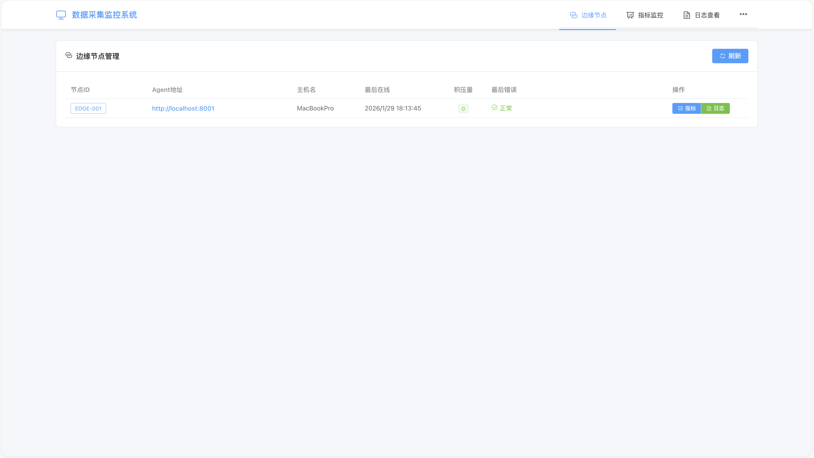
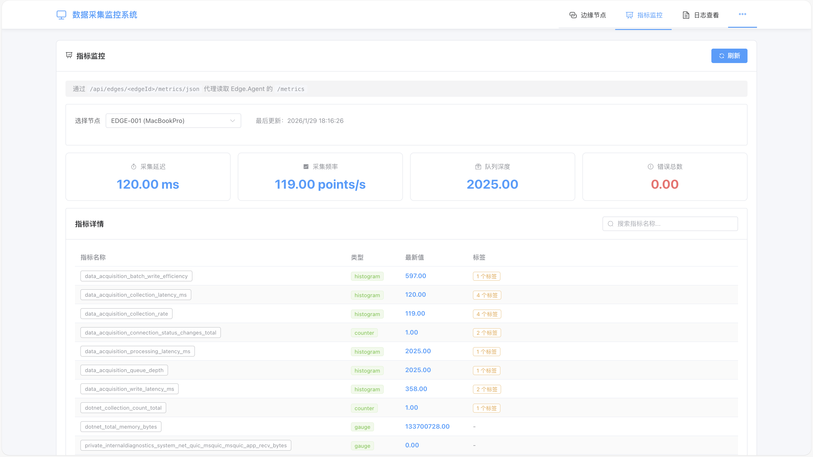
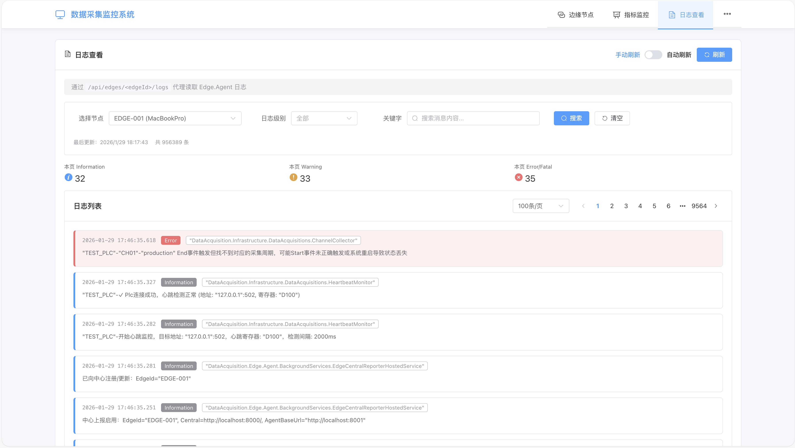

<a id="top"></a>

<div align="center">
  <h1 align="center">DataAcquisition</h1>
  <p align="center">
    An open-source PLC data acquisition runtime for industrial edge environments, focused on stable connectivity, configuration-driven collection, direct TSDB writes, and runtime diagnostics.
    <br />
    <a href="./docs/index.en.md"><strong>Explore the docs »</strong></a>
    <br />
    <br />
    <a href="https://github.com/liuweichaox/DataAcquisition">Project Home</a>
    ·
    <a href="https://github.com/liuweichaox/DataAcquisition/issues">Report Bug</a>
    ·
    <a href="https://github.com/liuweichaox/DataAcquisition/pulls">Contribute</a>
  </p>
</div>

<div align="center">

[![.NET][dotnet-shield]][dotnet-url]
[![Vue][vue-shield]][vue-url]
[![InfluxDB][influxdb-shield]][influxdb-url]
[![Stars][stars-shield]][stars-url]
[![Issues][issues-shield]][issues-url]
[![License][license-shield]][license-url]

</div>

[中文](README.md) | English

## Table of Contents

- [About The Project](#about-the-project)
- [Built With](#built-with)
- [Getting Started](#getting-started)
- [Usage](#usage)
- [Architecture](#architecture)
- [Repository Layout](#repository-layout)
- [Documentation](#documentation)
- [Roadmap](#roadmap)
- [Contributing](#contributing)
- [License](#license)
- [Acknowledgments](#acknowledgments)

## About The Project

DataAcquisition is an open-source PLC data acquisition runtime for industrial edge environments. It is designed to run close to equipment, where it handles PLC communication, configuration-driven collection, batched writes into a time-series database, and runtime diagnostics.

The main product is the `Edge Agent`. It owns the collection path, reads PLC values, organizes acquisition tasks, batches messages, and writes them directly into a TSDB. The default implementation is InfluxDB. `Central API / Central Web` are optional control-plane components for node status, metrics, and log visibility rather than required runtime dependencies.

### Core Capabilities

- reliable PLC data collection
- explicit JSON-based configuration for devices, channels, and acquisition modes
- support for both `Always` and `Conditional` acquisition modes
- batched direct writes into a `TSDB`
- configuration validation, hot reload, and runtime diagnostics
- optional centralized visibility for status, metrics, and logs

### System Boundary

- the `Edge Agent` is the core runtime component and the acquisition path comes first
- `Central API / Central Web` are optional control-plane components
- the current runtime focuses on real-time collection and observability rather than local durable replay
- when TSDB writes fail, the runtime logs and drops the current batch instead of persisting a local WAL
- drivers are selected by stable `Driver` names without hiding the real differences between PLC protocols

### Control Plane Preview

| Edges | Metrics | Logs |
| --- | --- | --- |
|  |  |  |

### Primary Use Cases

- shop-floor PLC real-time data acquisition
- multi-PLC deployments with explicit configuration
- direct TSDB telemetry pipelines from the edge
- environments that need metrics, logs, and centralized node visibility
- industrial scenarios that prefer a lightweight runtime close to equipment

<p align="right">(<a href="#top">back to top</a>)</p>

## Built With

- `.NET 10` / `ASP.NET Core` for Edge Agent and Central API hosting
- `Vue 3` + `Vue Router` + `Element Plus` for the control-plane web UI
- `InfluxDB 2.x` as the default time-series store
- `SQLite` for local logs and conditional acquisition state
- `HslCommunication` as the default PLC driver implementation base
- `prometheus-net` for metrics
- `Serilog` for logging

<p align="right">(<a href="#top">back to top</a>)</p>

## Getting Started

### Prerequisites

- `.NET 10 SDK`
- `InfluxDB 2.x`
- `Docker` if you want to use the included compose file for InfluxDB
- `pnpm` if you want to run the central web UI locally

### Local Setup

1. Clone the repository

```bash
git clone https://github.com/liuweichaox/DataAcquisition.git
cd DataAcquisition
```

2. Build the solution

```bash
dotnet build DataAcquisition.sln
```

3. Start InfluxDB

```bash
docker compose -f docker-compose.tsdb.yml up -d
```

Notes:

- the default Edge Agent connection settings live in [src/DataAcquisition.Edge.Agent/appsettings.json](src/DataAcquisition.Edge.Agent/appsettings.json)
- if you use your own InfluxDB instance, make sure `InfluxDB:Url`, `Token`, `Bucket`, and `Org` match your environment

4. Review device configuration

- sample config: [src/DataAcquisition.Edge.Agent/Configs/TEST_PLC.json](src/DataAcquisition.Edge.Agent/Configs/TEST_PLC.json)
- more examples: [examples/device-configs](examples/device-configs)
- JSON Schema: [schemas/device-config.schema.json](schemas/device-config.schema.json)

5. Validate configs offline

```bash
dotnet run --project src/DataAcquisition.Edge.Agent -- --validate-configs
```

To validate another directory:

```bash
dotnet run --project src/DataAcquisition.Edge.Agent -- --validate-configs --config-dir ./examples/device-configs
```

6. Start the Edge Agent

```bash
dotnet run --project src/DataAcquisition.Edge.Agent
```

7. Optional: start the local PLC simulator

```bash
dotnet run --project src/DataAcquisition.Simulator
```

8. Optional: start the central API and web UI

```bash
dotnet run --project src/DataAcquisition.Central.Api
cd src/DataAcquisition.Central.Web
pnpm install
pnpm run serve
```

Default local URLs:

- Edge Agent: `http://localhost:8001`
- Central API: `http://localhost:8000`
- Central Web: `http://localhost:3000`

<p align="right">(<a href="#top">back to top</a>)</p>

## Usage

### Typical Local Flow

If you want to verify the full pipeline locally, this is the easiest order:

1. Start `InfluxDB`
2. Start `DataAcquisition.Simulator`
3. Validate [TEST_PLC.json](src/DataAcquisition.Edge.Agent/Configs/TEST_PLC.json)
4. Start `DataAcquisition.Edge.Agent`
5. Optionally start `DataAcquisition.Central.Api` and `DataAcquisition.Central.Web`
6. Confirm status through health checks, metrics, logs, and the UI

### Common Endpoints

| Component | URL | Purpose |
| --- | --- | --- |
| Edge Agent | `http://localhost:8001/health` | health check |
| Edge Agent | `http://localhost:8001/metrics` | Prometheus metrics |
| Edge Agent | `http://localhost:8001/api/logs` | local log query |
| Edge Agent | `http://localhost:8001/api/DataAcquisition/plc-connections` | PLC connection status |
| Central API | `http://localhost:8000/metrics` | central metrics |
| Central Web | `http://localhost:3000` | node, metrics, and logs UI |

### Local Runtime Files

During runtime, these files matter most:

- `Data/logs.db`
- `Data/acquisition-state.db`

What to watch:

- `logs.db` stores local logs for PLC connectivity, configuration, and TSDB write diagnostics
- `acquisition-state.db` stores active-cycle recovery state for conditional acquisition
- if the TSDB is not receiving data, inspect Edge logs and `/metrics` first because the current runtime does not build a local replay backlog

<p align="right">(<a href="#top">back to top</a>)</p>

## Architecture

### Main Path

```text
JSON Device Configs
        |
        v
+-------------------+       +----------------+
|    Edge Agent     | <---- | PLC / Device   |
| - load configs    |       +----------------+
| - collect data    |
| - batch messages  |
| - expose metrics  |
+---------+---------+
          |
          v
   +-------------+
   | Queue/Batch |
   +------+------+
          |
          v
   +-------------+
   |    TSDB     |
   +-------------+

Edge Agent
  |--> SQLite: acquisition-state.db
  |--> SQLite logs + /metrics
```

### Deployment View

```text
Browser
   |
   v
Central Web
   |
   v
Central API
   |
   |  (optional control plane)
   v
Edge Agent -----> PLC / Device
     |
     +---------> TSDB
```

### How To Read This

- `Edge Agent` is the core of the system and owns collection, batched writes, and local diagnostics
- `JSON Device Configs` define what to collect, how to connect to PLCs, and which acquisition mode to use
- `Queue / Batch` means in-memory aggregation before writing, not a local durable buffer
- `TSDB` is the storage abstraction, and the default implementation is InfluxDB; success is determined by the store's write result
- `SQLite acquisition-state.db` stores conditional-acquisition context only, so restart recovery can preserve cycle semantics
- `SQLite logs + /metrics` are for troubleshooting and observability, not for replaying raw data
- `Central API / Central Web` are optional control-plane components for visibility, not prerequisites for collection

### Failure Semantics

- TSDB write succeeds: the current batch is complete
- TSDB write fails: the runtime logs the failure, emits metrics, and drops the current batch
- later acquisition work continues without a replay worker or local WAL

### Design Priorities

- `Edge First`
  The Edge Agent owns the acquisition path and does not depend on the control plane to keep running.
- `Real-Time First`
  Batches are written directly to the TSDB; failures are logged and dropped instead of replayed locally.
- `Configuration Before Runtime`
  Device configs should be validated before the runtime is allowed to start.
- `Explicit Driver Contracts`
  Protocol implementations are selected by stable `Driver` names with explicit extension points.
- `Observability First`
  Logs, metrics, and the central view make runtime failures visible instead of hiding them behind local recovery queues.
- `UTC`
  Acquisition timestamps use UTC semantics to keep multi-node behavior predictable.

For more implementation detail, start with [docs/design.en.md](docs/design.en.md) and [docs/modules.en.md](docs/modules.en.md).

<p align="right">(<a href="#top">back to top</a>)</p>

## Repository Layout

- [src/DataAcquisition.Edge.Agent](src/DataAcquisition.Edge.Agent)
  edge runtime host for the acquisition pipeline and local diagnostics endpoints
- [src/DataAcquisition.Infrastructure](src/DataAcquisition.Infrastructure)
  PLC drivers, orchestration, queueing, InfluxDB, SQLite, logging, and metrics implementations
- [src/DataAcquisition.Application](src/DataAcquisition.Application)
  abstractions, CQRS handlers, and runtime contracts
- [src/DataAcquisition.Domain](src/DataAcquisition.Domain)
  domain, configuration, and message models
- [src/DataAcquisition.Central.Api](src/DataAcquisition.Central.Api)
  central registration, heartbeat, logs, and metrics proxy API
- [src/DataAcquisition.Central.Web](src/DataAcquisition.Central.Web)
  Vue-based control plane
- [src/DataAcquisition.Simulator](src/DataAcquisition.Simulator)
  local PLC simulator for integration and demo flows
- [tests/DataAcquisition.Core.Tests](tests/DataAcquisition.Core.Tests)
  core test project

<p align="right">(<a href="#top">back to top</a>)</p>

## Documentation

Suggested reading order:

1. [Getting Started](docs/tutorial-getting-started.en.md)
2. [Configuration](docs/tutorial-configuration.en.md)
3. [Driver Catalog](docs/hsl-drivers.en.md)
4. [Deployment](docs/tutorial-deployment.en.md)

Then go deeper by topic:

- [Design](docs/design.en.md)
- [Modules](docs/modules.en.md)
- [Development](docs/tutorial-development.en.md)
- [FAQ](docs/faq.en.md)
- [Contributing](CONTRIBUTING.en.md)

<p align="right">(<a href="#top">back to top</a>)</p>

## Roadmap

Based on the current design and docs, the most valuable next steps are:

- [ ] add more real-world PLC sample configs
- [ ] expand end-to-end test coverage
- [ ] improve `ProtocolOptions` coverage for major drivers
- [ ] deepen troubleshooting and operations docs
- [ ] improve central observability and diagnostics workflows

Use [Issues](https://github.com/liuweichaox/DataAcquisition/issues) for open problems and feature discussions.

<p align="right">(<a href="#top">back to top</a>)</p>

## Contributing

Contributions are welcome across driver enhancements, acquisition-path reliability fixes, TSDB write improvements, docs, sample configs, and automated tests.

Before opening a PR, it is a good idea to confirm:

- the solution builds successfully
- relevant tests pass
- README, tutorials, and sample configs are updated together

See [CONTRIBUTING.en.md](CONTRIBUTING.en.md) for the full contribution guidelines.

<p align="right">(<a href="#top">back to top</a>)</p>

## License

Distributed under the [MIT License](LICENSE).

<p align="right">(<a href="#top">back to top</a>)</p>

## Acknowledgments

- [Best-README-Template](https://github.com/othneildrew/Best-README-Template)
- [HslCommunication](https://github.com/dathlin/HslCommunication)
- [InfluxDB](https://www.influxdata.com/)

<p align="right">(<a href="#top">back to top</a>)</p>

[dotnet-shield]: https://img.shields.io/badge/.NET-10-512BD4?style=for-the-badge&logo=dotnet&logoColor=white
[dotnet-url]: https://dotnet.microsoft.com/
[vue-shield]: https://img.shields.io/badge/Vue-3-42B883?style=for-the-badge&logo=vuedotjs&logoColor=white
[vue-url]: https://vuejs.org/
[influxdb-shield]: https://img.shields.io/badge/InfluxDB-2.x-22ADF6?style=for-the-badge&logo=influxdb&logoColor=white
[influxdb-url]: https://www.influxdata.com/
[stars-shield]: https://img.shields.io/github/stars/liuweichaox/DataAcquisition.svg?style=for-the-badge
[stars-url]: https://github.com/liuweichaox/DataAcquisition/stargazers
[issues-shield]: https://img.shields.io/github/issues/liuweichaox/DataAcquisition.svg?style=for-the-badge
[issues-url]: https://github.com/liuweichaox/DataAcquisition/issues
[license-shield]: https://img.shields.io/github/license/liuweichaox/DataAcquisition.svg?style=for-the-badge
[license-url]: https://github.com/liuweichaox/DataAcquisition/blob/main/LICENSE
