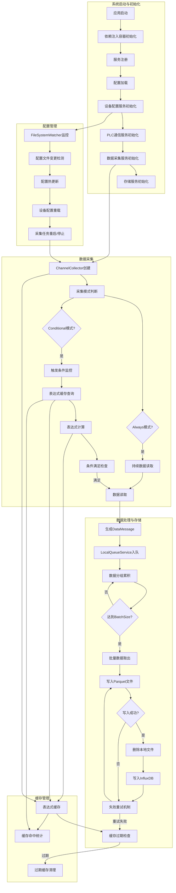
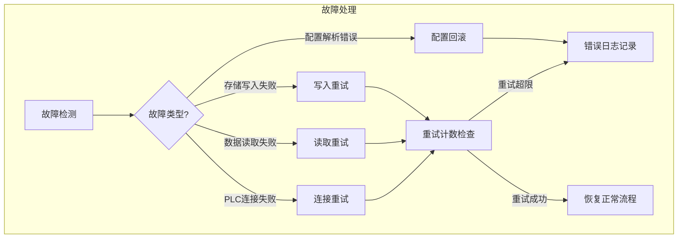
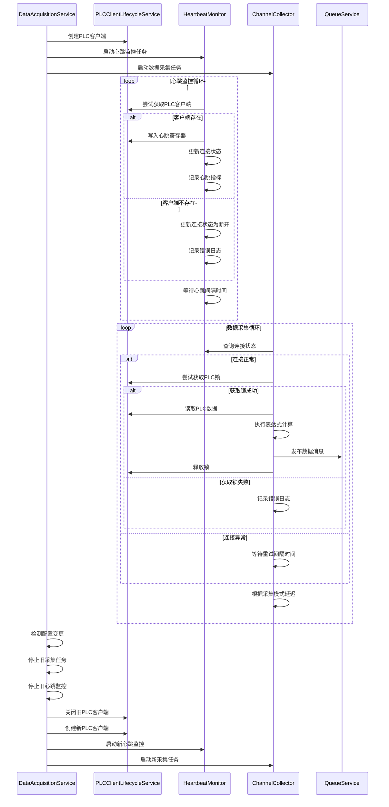

# DataAcquisition 系统运行流程图

## 1. 系统架构概述

DataAcquisition是一个基于DDD设计的PLC数据采集系统，采用分层架构设计，主要包括以下核心模块：

- **Domain**: 领域模型层，定义核心业务实体和接口
- **Application**: 应用服务层，协调领域对象完成业务逻辑
- **Infrastructure**: 基础设施层，提供数据存储、队列、配置等基础服务
- **Gateway**: 设备通信网关，处理与PLC设备的通信协议
- **Simulator**: 设备模拟器，用于测试和开发环境

## 2. 完整运行流程图

## 3. 核心流程说明

### 3.1 系统启动流程

1. **应用启动**：程序入口点启动，初始化宿主环境
2. **依赖注入容器初始化**：配置Autofac依赖注入容器
3. **服务注册**：注册所有核心服务（配置服务、通信服务、采集服务、存储服务等）
4. **配置加载**：从appsettings.json和环境变量加载系统配置
5. **设备配置服务初始化**：加载设备配置文件，解析PLC连接信息
6. **PLC通信服务初始化**：建立与PLC设备的通信连接池
7. **数据采集服务初始化**：为每个配置的通道创建ChannelCollector实例
8. **存储服务初始化**：初始化Parquet文件写入器和InfluxDB客户端

### 3.2 配置管理流程

1. **FileSystemWatcher监控**：监控设备配置文件目录的变更
2. **配置文件变更检测**：当检测到文件创建、修改或删除时触发事件
3. **配置热更新**：解析新的配置文件内容，验证配置有效性
4. **设备配置重载**：更新内存中的设备配置信息
5. **采集任务重启/停止**：根据新配置重新创建或停止相应的采集任务

### 3.3 数据采集流程

1. **ChannelCollector创建**：为每个PLC通道创建独立的采集器实例
2. **采集模式判断**：根据配置确定是Always模式还是Conditional模式
3. **Always模式**：无条件持续读取PLC数据
4. **Conditional模式**：
   - 监控触发条件表达式
   - 查询表达式缓存（避免重复解析）
   - 计算表达式结果
   - 条件满足时读取数据

### 3.4 数据处理与存储流程

1. **生成DataMessage**：将采集到的原始数据转换为统一的数据消息格式
2. **LocalQueueService入队**：将数据消息发送到本地队列服务
3. **数据分组累积**：按"PLC+通道+测量值"分组累积数据
4. **批量处理触发**：当累积数量达到BatchSize时触发批量处理
5. **批量数据取出**：从队列中取出批量数据
6. **写入Parquet文件**：使用预写日志（WAL）机制写入Parquet文件
7. **写入成功检查**：验证Parquet文件写入是否成功
8. **删除本地文件**：成功写入InfluxDB后删除本地Parquet文件
9. **写入InfluxDB**：将数据批量写入时序数据库
10. **失败重试机制**：写入失败时进行重试（最多3次）

### 3.5 缓存管理流程

1. **表达式缓存**：使用ConcurrentDictionary缓存NCalc表达式实例
2. **缓存过期检查**：定期检查缓存项是否过期（默认24小时）
3. **过期缓存清理**：每小时清理一次过期的缓存项
4. **缓存命中统计**：记录缓存命中率，用于性能优化分析

## 4. 性能优化点

### 4.1 并发控制优化

- **细粒度锁**：将全局锁替换为按文件/批次/表达式缓存的细粒度锁
- **线程安全数据结构**：使用ConcurrentQueue和ConcurrentDictionary替代非线程安全集合
- **信号量控制**：使用SemaphoreSlim实现异步并发控制

### 4.2 异步处理优化

- **移除冗余异步操作**：删除不必要的Task.Yield()和Task.Run()
- **异步方法链**：使用async/await保持异步操作链的连续性
- **批量异步处理**：合并多个异步操作，减少上下文切换

### 4.3 缓存机制优化

- **表达式缓存**：避免NCalc表达式重复解析开销
- **配置缓存**：缓存配置变更检测延迟参数
- **缓存过期策略**：使用带过期时间的缓存，避免内存泄漏

### 4.4 存储性能优化

- **WAL-first架构**：采用预写日志机制确保数据可靠性
- **批量写入**：减少I/O操作次数，提高写入吞吐量
- **压缩存储**：使用Snappy压缩Parquet文件，减少存储空间占用

### 4.5 配置管理优化

- **热更新机制**：无需重启服务即可加载新配置
- **变更检测优化**：缓存配置变更检测参数，减少重复解析
- **增量更新**：仅更新变更的配置项，提高更新效率

## 5. 故障处理流程

## 6. 关键技术特性

1. **分层架构设计**：基于DDD的分层架构，实现关注点分离
2. **PLC数据采集模式**：支持Always和Conditional两种采集模式
3. **WAL-first存储**：确保数据可靠性和持久性
4. **配置热更新**：支持动态加载设备配置
5. **批量处理策略**：减少I/O次数，提高系统吞吐量
6. **并发控制优化**：降低锁竞争，提高系统并发能力
7. **表达式缓存机制**：避免重复解析开销
8. **故障自动恢复**：具备完善的重试和错误处理机制

## 7. 设备连接与采集任务交互模式

设备连接动作和采集任务采用解耦设计，通过连接状态查询机制协调工作，既保证了采集任务的可靠性，又提高了系统的灵活性和可维护性。

### 7.1 交互流程图

### 7.2 解耦设计的核心特点

1. **独立组件职责**
   - `PLC`：专注于PLC客户端生命周期管理
   - `HB`：独立的心跳监控服务
   - `CC`：专注于数据采集逻辑
   - `DAS`：协调各组件工作

2. **状态查询机制**
   - 采集任务不直接管理连接状态
   - 通过心跳监控服务提供的连接状态查询接口获取连接信息
   - 连接状态变化时，采集任务自动适应

3. **并行执行模式**
   - 心跳监控和数据采集并行执行
   - 配置变更时有序停止和重启相关任务

4. **容错处理**
   - 连接异常时，采集任务等待重试
   - 锁获取失败时，记录错误但不中断采集循环
   - 各组件异常独立处理，不影响整体系统稳定性

## 8. 系统扩展点

1. **设备通信协议扩展**：支持添加新的PLC通信协议
2. **存储后端扩展**：支持扩展到其他时序数据库
3. **采集模式扩展**：支持自定义采集模式
4. **告警规则扩展**：支持添加自定义告警规则
5. **可视化接口扩展**：支持添加Web或桌面可视化界面

---

*本流程图基于DataAcquisition系统v1.0版本绘制，反映了系统的核心运行逻辑和性能优化点。*
